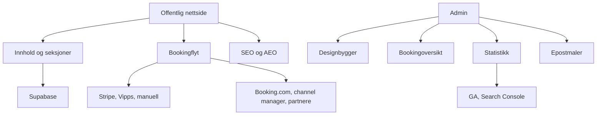

# Arkitektur og videre plan

## Mål

Bygge en tung, men salgbar grunnmur for turismeaktører der vi kan starte fra
samme kodebase hver gang og tilpasse innhold, design og integrasjoner per kunde.

## Hovedlag

## Designbygger

Første versjon bør bruke en kontrollert blokkmodell, ikke helt fri canvas.
Det gir kunden fleksibilitet uten at designet ødelegges.

Blokker:

- Hero
- Booking
- Aktiviteter
- Overnatting
- Artikler
- Anmeldelser
- Kart
- FAQ
- CTA

Kunden bør kunne:

- Endre rekkefølge.
- Skjule og vise blokker.
- Endre tittel, tekst, bilde og CTA.
- Velge mellom tre maler.
- Endre farger, fonter, logo og avrunding.

## Booking

Booking bør bygges i nivåer:

1. Forespørsel med adminstatus og epost.
2. Betaling med Stripe/Vipps.
3. Tilgjengelighetskalender.
4. Adapter mot ekstern booking/channel manager.
5. Eventuell direkte Booking.com-integrasjon hvis kunde har riktig tilgang.

## Adminroller

Anbefalt minimum:

- Eier: alt.
- Redaktør: innhold, bilder, artikler og design.
- Bookingansvarlig: bookinger, meldinger, betaling og epost.
- Leser: statistikk og oversikt.

Rolledata bør ligge i Supabase `app_metadata`, ikke brukerredigerbar metadata.

## Salgspakker

Start:

- Nettside
- CMS/admin
- Designmal
- Aktiviteter/overnatting
- Artikler
- Manuell bookingforespørsel

Proff:

- Alt i Start
- Stripe/Vipps
- Bookingdashboard
- Epostmaler
- SEO/AEO-oppsett
- Tre språk

Premium:

- Alt i Proff
- Channel manager-adapter
- Google Search Console/Analytics dashboard
- Anmeldelser
- Flere landingssider
- Avansert artikkel- og kampanjemodul

## Neste tekniske steg

1. Koble booking-API til Supabase.
2. Lage ekte adminskjemaer for designinnstillinger og seksjoner.
3. Legge inn drag-and-drop med for eksempel `@dnd-kit`.
4. Lage auth og adminroller.
5. Lage Stripe webhook for betalt booking.
6. Lage Vipps/MobilePay-adapter når avtale og API-nøkler finnes.
7. Lage Search Console/Analytics-import.
8. Lage strukturert data per side og artikkel.
9. Legge inn flerspråklige ruter.
10. Lage GitHub Actions for lint/build/deploy.
